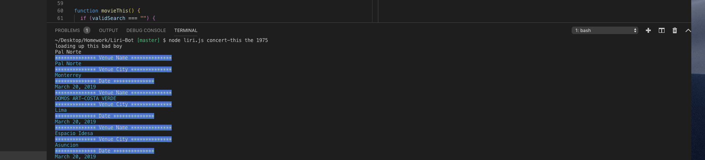
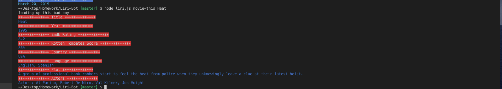
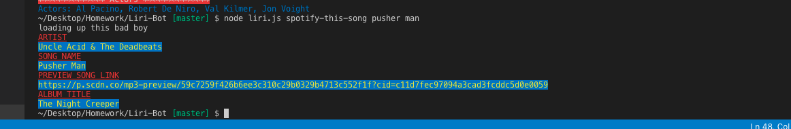
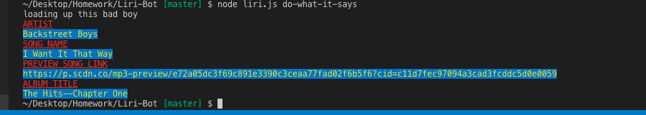

# Liri-Bot
Liri-Bot Repository HW
(Screenshots included at the bottom)

About Liri

Liri stands for Langauge Interpretation and Recognition Interface. Using LIRI, you can type in any commands for songs, movies, and concerts and receive a response right in the terminal!

Motivation
This application is aimed to help save time, and help deliver real time information to a user within a single console using merely 4-6 words. 

Key Technologies Used

Node.js
JavaScript
NPM Packages - require, spotify, axios, chalk

Instructions and Results

Movies

To receive information on movies, simply type in "movie-this" followed by the name of the movie you would like to get information on. You will then receive the following information listed out:

Title of the movie
Year of the release
IMDB Rating
Rotten Tomatoes Rating
Country produced
Language
Plot
Actors

If a movie is unreconigzed, the application will search the movie "Mr. Nobody" by default.

Concerts

To receive information on concerts, simply type in "concert-this" followed by the artist you would like to receive information on. The application will then reply with the following information

Upcoming Concerts Date
Upcoming Concert Venues
Upcoming Concert Cities

Spotify 

To receive information on any song of your choice, type in "spotify-this-song" followed by the title of the song you would like. The application will reply with the top song under that title with the

Artist Name
Song Title
Snippet of the song link (via Spotify)
Name of the Album

Do What it Says

Upon using the command "do-what-it-says" the Liri application will leverage FS to connect with the random.txt file and do whatever command is listed. By default the command listed in the random.txt file is spotify-this-song "I want it that way" by the Backstreet Boys.

Attached in the repository are pictures of the Liri Application working

Concert-This

Movie-This

Spotify-This

Do-What-It-Says Screenshot
